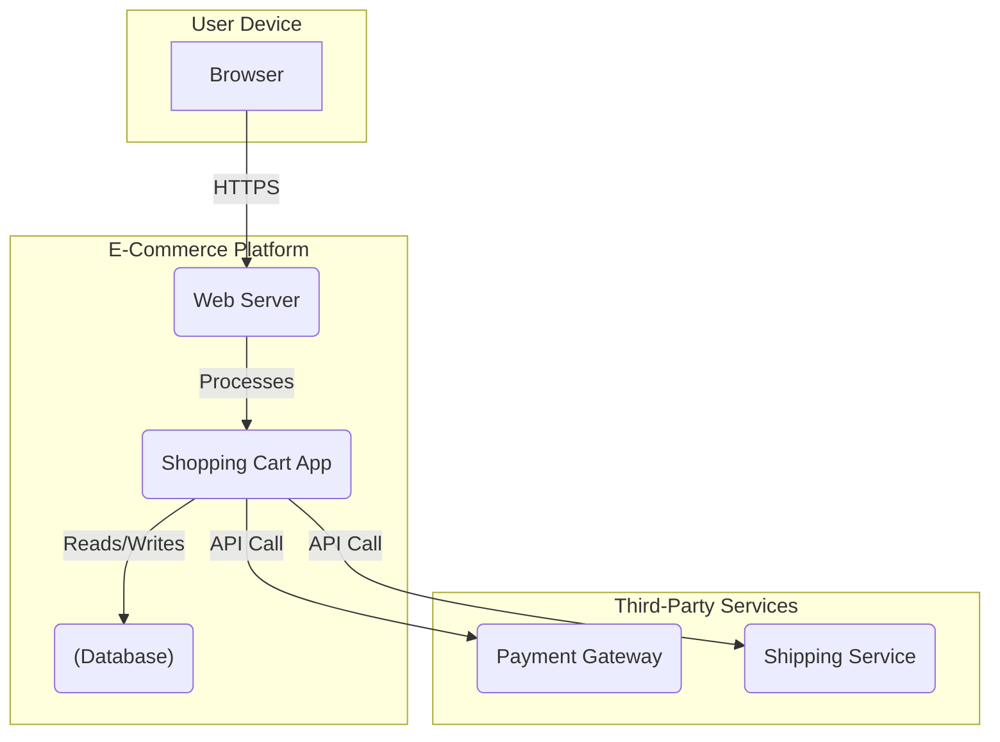

# markdowns

Here is a graph:

```mermaid
graph TD
    subgraph "User Device"
        Browser
    end

    subgraph "E-Commerce Platform"
        WebServer("Web Server")
        WebApp("Shopping Cart App")
        DB("(Database)")
    end

    subgraph "Third-Party Services"
        PaymentGateway("Payment Gateway")
        ShippingService("Shipping Service")
    end

    Browser -- HTTPS --> WebServer
    WebServer -- Processes --> WebApp
    WebApp -- Reads/Writes --> DB
    WebApp -- API Call --> PaymentGateway
    WebApp -- API Call --> ShippingService
``` 
